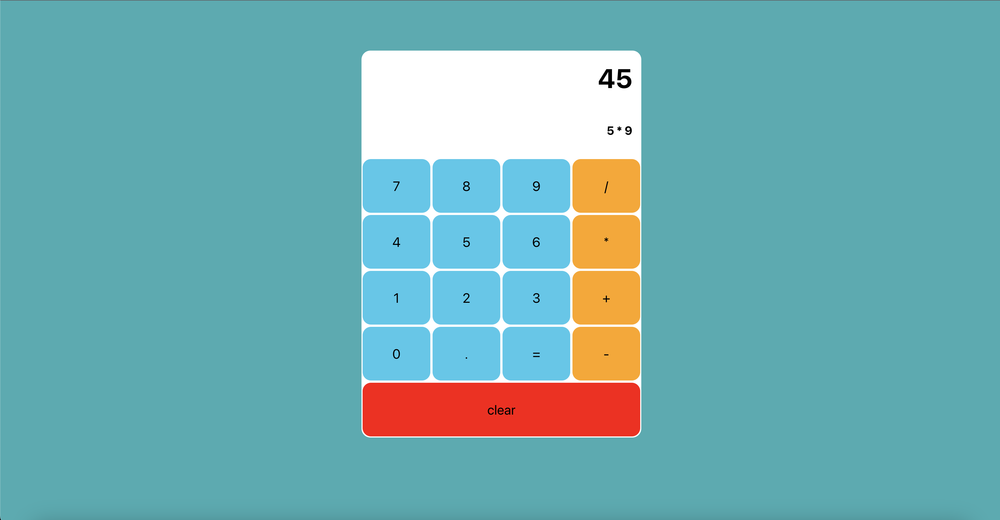

# React Calculator
  
  ## ReadMe Description 

  This is a basic calculator to practice using React.js props, and also the useState hook.  
  ## Table of Contents: 

  * [Installation](#installation) 

  * [Contributors](#contributors) 

  * [Usage](#usage) 

  * [Tests](#tests) 

  * [Questions](#questions) 

  * [License](#license) 

  ## Name: 

  Sebastian Tischner
  
  ## Installation 

  no installation needed! 
  
  ## Contributors 

  Fork repository
  
  ## Usage 

  access application by website, and use as a normal calculator 
  
  ## Tests 

  no tests
  
  ## License 
 
  This project is protected by the MIT license.
  
  ## Questions 

  Github: [Sebascrab](https://github.com/Sebascrab) 

  Email: alexanders.tischner@outlook.com  

  

  Deployed: [Click Here to view](https://react-app-sb.herokuapp.com/)

  

